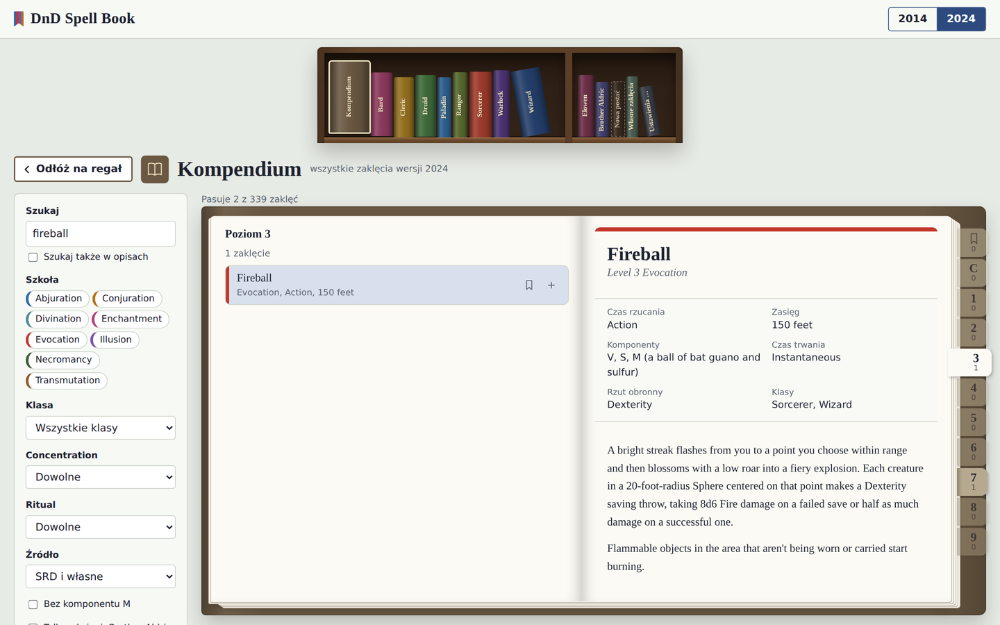
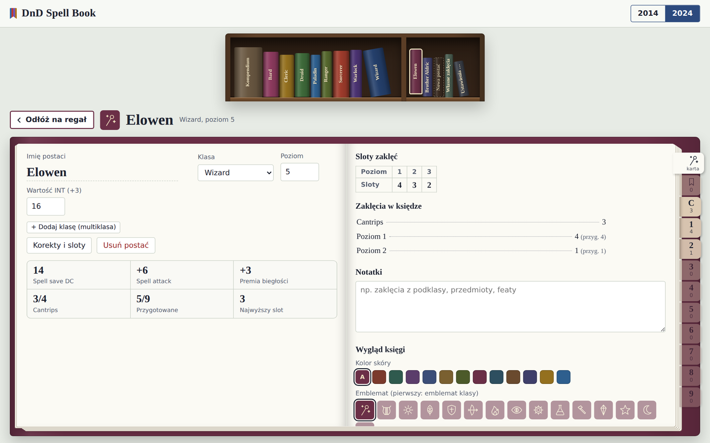
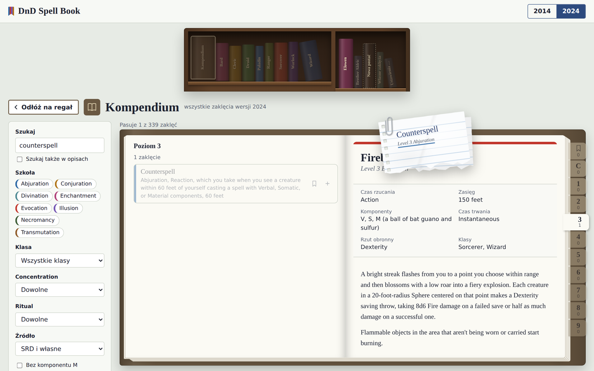
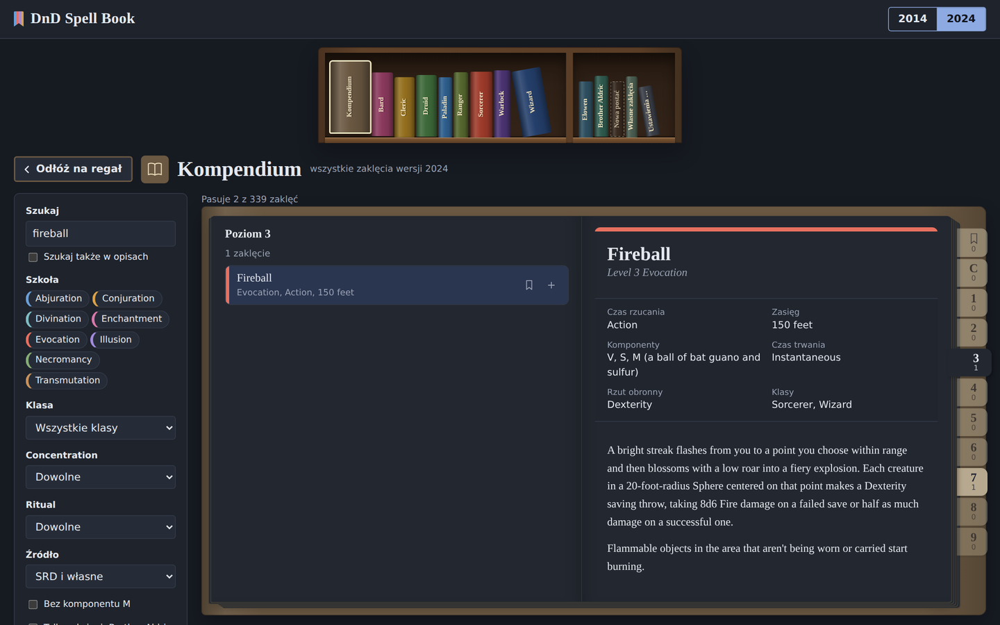

# DnD Spell Book

A spellbook manager for Dungeons & Dragons 5e, built as a bookshelf of physical books. Every part of the app is a book on the shelf: pull one out and it opens into a two-page spread, with tabbed spell levels you flip through page by page.

**[Open the live app](https://Snopeczek.github.io/dnd-spell-book/)**. Nothing to install; it runs entirely in the browser and works offline.

> The interface is currently in Polish. Spell names and descriptions are in English, as in the SRD.



## Features

- **Bookshelf navigation.** The top shelf holds the compendium and a book for each class; the shelves below hold one book per character, your homebrew spells, and settings. Spines grow thicker as a book fills with spells.
- **Books that behave like objects.** Books spring back when you brush them with the cursor, open as 3D volumes, and turn pages with a curling sheet built from ten hinged strips. Jumping several levels fans through several pages at once. All motion respects the system's reduced-motion setting.
- **Two rule sets side by side.** 2014 (SRD 5.1, 319 spells) and 2024 (SRD 5.2, 339 spells) run as separate modes with separate data and characters.
- **Character books** with class, level, spellcasting ability, save DC, attack bonus, spell slots, prepared or known spell limits, notes, and a choice of cover colour and emblem.
- **Multiclassing** following the SRD rules for each edition: shared multiclass slot table, separate Pact Magic slots, and a DC and attack bonus per class.
- **Drag and drop.** Pick up a spell and it hangs from your cursor as a paper slip on a pendulum. Drop it onto a character's book, and only spells from that character's class lists are accepted.
- **Search and filters** by school, class, concentration, ritual, components and source, plus ribbons to bookmark favourites in any book.
- **Homebrew spells and classes** through JSON import, full backup and restore, and undo for every destructive action.

| Character book | Dragging a spell | Dark theme |
|---|---|---|
|  |  |  |

## How it's built

Plain HTML, CSS and JavaScript: no framework, no bundler, no dependencies. The source is split into numbered modules in `src/js/`, and a short Python script inlines the styles, both SRD datasets and all modules into one self-contained HTML file. That same file is the live site, the offline app, and the heart of the Windows package.

The animations are hand-written: spring physics with damping for the shelf, a segmented page mesh with angle-dependent shading for page turns, and a pendulum simulation for the dragged slip.

The app is covered by a browser test suite written with Playwright (over 200 checks across page turns, drag and drop, limits, multiclassing, import, backup and data migration), which runs automatically on every push.

A detailed walkthrough of the behaviour, modules and data formats (in Polish) is in [docs/DEVELOPMENT.pl.md](docs/DEVELOPMENT.pl.md).

```
src/
  index.html          page template with build markers
  styles.css          all styles, light and dark
  data/               normalised SRD 5.1 and 5.2 spell data
  js/                 app modules, included in numeric order
tools/
  build.py            builds the single-file app and the Windows package
  fetch_data.py       downloads and normalises the SRD data
  launcher/           launcher and shortcut scripts for Windows
tests/                Playwright tests; run_all.py runs the whole suite
```

## Running it

**Online:** use the live link above.

**Building** (Python 3.8+, no extra libraries):

```
python tools/build.py            # dist/DnD Spell Book.html and dist/DnD Spell Book.zip
python tools/build.py --no-zip   # the HTML file only
```

**Working on the source without building:** run `python -m http.server` inside `src/` and open `http://localhost:8000`.

**Tests:**

```
pip install playwright
python -m playwright install chromium
python tools/build.py --no-zip
python tests/run_all.py
```

The Windows package opens the app in its own window (Edge or Chrome app mode) and can create desktop and Start menu shortcuts. A ready-made zip is attached to each [release](../../releases).

## Licence

The code is released under the [MIT Licence](LICENSE).

Spell and class data comes from the System Reference Document 5.1 and 5.2 by Wizards of the Coast, licensed under Creative Commons Attribution 4.0. See [NOTICE.md](NOTICE.md) for the full attribution. The class emblems are original drawings made for this project.

This is an unofficial fan project. It is not affiliated with, endorsed, sponsored, or specifically approved by Wizards of the Coast. Dungeons & Dragons is a trademark of Wizards of the Coast LLC.
